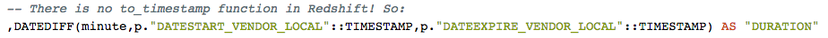
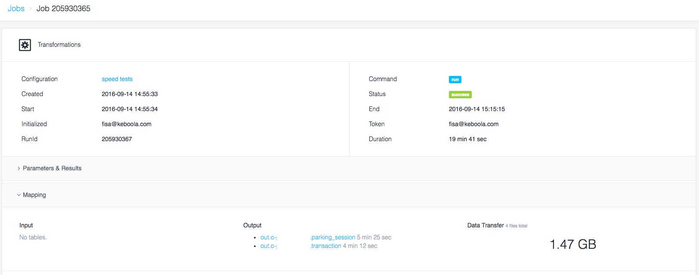

# Intro  
At the same time as the [announcement](http://blog.keboola.com/new-dose-of-steroids-in-the-keboola-backend) about default backend in KBC being shifted to Snowflake, I have started working on a new project with our Vancouver customer. They pushed us the initial dump of two main tables (10M rows each) and some other small attribute tables.  
   

The main transformation handles initial join of one of the big table and a handful of small ones:  

  

and then it is meshed with the other big table, on which we have to calculate duration and apply multiple cases:   

  

  

Originally, I had a complete transformations done in MySQL since I've used that transformation for data exploration on a small sample of data.  
However, I had to kill the transformation after 36 minutes of running and not delivering a single output table...

## Speed comparison  
 Since MySQL was not an option, I have tested and compared both Redshift and new Snowflake transformations.
It took almost 20 minutes to Redshift to cope with this transformation. In contrast, it took only 5 minutes to Snowflake!
Furthermore, I have explored (thanks Marcus) the difference between
``` CREATE TABLE ``` and ```CREATE VIEW``` : There is a subtle difference between those, it will actually shave off some time to use *VIEW* (the difference is between 7-10%). 

## Overview  

| SQL          | Table creation | Duration  |
| ------------- |:-------------| -----:|
| Redshift      | _TABLE_ | **19:41** |
| Redshift      | _VIEW_      |   **17:46** |
| Snowflake | _TABLE_      |    **5:09** |
| Snowflake | _VIEW_      |    **4:45** |

## Screenshots  
**Redshift**  

**Snowflake**  


## Notes  
The purpose of this exercise was to evaluate the speed from the user perspective. In other words, I have measured both table data load and transformations.
This represents the full user experience with both storage and transformation back-ends.
